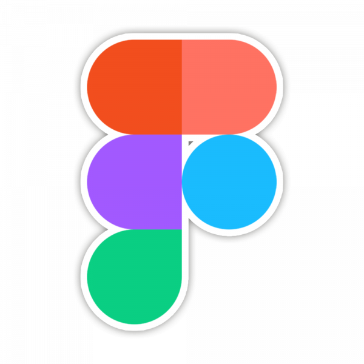

**Hello world, my name is Olena 👋**

- 🌱 I’m currently learning something new and enjoy what I do
- 🎓 I've hands-on experience building React applications
- 💼 I'm opened for new job opportunities and consider any with pleasure
  
**📫 Reach me out!**

  

### 👨🏻‍💻 My stack and tools

        

### ⭐️ My stats

